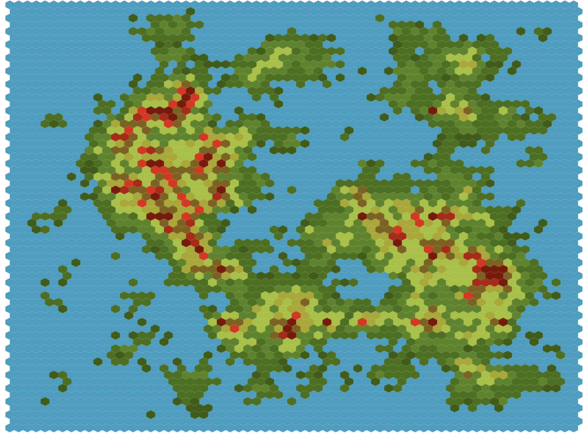

# Map generator

A simple hexagonal map generator writen in JavaScript and expressJS.

## Requirements

- node JS (tested in 8.11.1 version)
- npm

## Installation

- run `npm install` command
- run `npm run start` command
- enjoy `http://localhost:3000/map/generate` url in web browser